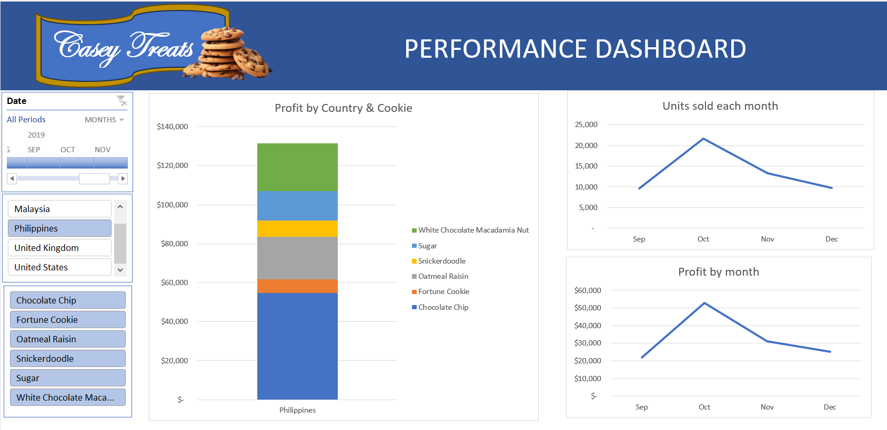

# Performance Dashboard

An Excel-based dashboard designed to track and analyze key performance indicators (KPIs) effectively.  
This project provides a simple yet powerful way to visualize performance data for better decision-making.

## Preview

## Files
- **Performance Dashboard.xlsx** — the main dashboard file.

## Features
- User-friendly Excel interface.  
- Visual dashboards for performance tracking.  
- Customizable metrics and charts.  
- Easy to update with new data.

## How to Use
1. Click on **Performance Dashboard.xlsx** in this repository.  
2. Select **Download raw file**.  
3. Open the file in **Microsoft Excel**.  
4. Explore the dashboard to view KPIs and metrics.

## About the Author
Created by **Omolabake Adesona**.  
- 📧 Email: adesonaomolabake09@gmail.com  
- 🔗 LinkedIn: [linkedin.com/in/omolabake-adesona](https://www.linkedin.com/in/omolabake-adesona/)  

## License
This project is licensed under the MIT License — see the [LICENSE](LICENSE) file for details.
